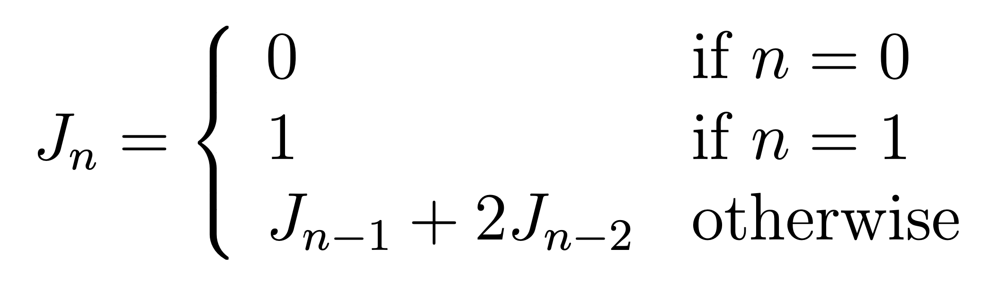

# Computer Science I
## Lab 12.0 - Recursion

This is a lab used in Computer Science I (CSCE 155E, CSCE 155H) in the
[School of Computing](https://computing.unl.edu/) at the
[University of Nebraska-Lincoln](https://unl.edu).

## 1. Overview

### Prior to Lab

Before attending this lab:

1.  Read and familiarize yourself with this handout.

2.  Read Chapters 11 and 24 of the [Computer Science
    I](http://cse.unl.edu/~cbourke/ComputerScienceOne.pdf) textbook

3.  Watch Videos 12.1 thru 12.3 of the [Computer Science
    I](https://www.youtube.com/playlist?list=PL4IH6CVPpTZVkiEnCEOdGbYsFEdtKc5Bx)
    video series

### Peer Programming Pair-Up

**For students in the online section:** you may complete the lab on your
own if you wish or you may team up with a partner of your choosing.  You
may consult with a lab instructor to get teamed up online (via Zoom).

**For students in the face-to-face section:** your lab instructor will
team you up with a partner.

To encourage collaboration and a team environment, labs are be
structured in a *peer programming* setup. At the start of each lab, you
will be randomly paired up with another student (conflicts such as
absences will be dealt with by the lab instructor). One of you will be
designated the *driver* and the other the *navigator*.

The navigator will be responsible for reading the instructions and
telling the driver what to do next. The driver will be in charge of the
keyboard and workstation. Both driver and navigator are responsible for
suggesting fixes and solutions together. Neither the navigator nor the
driver is "in charge." Beyond your immediate pairing, you are encouraged
to help and interact and with other pairs in the lab.

Each week you should alternate: if you were a driver last week, be a
navigator next, etc. Resolve any issues (you were both drivers last
week) within your pair. Ask the lab instructor to resolve issues only
when you cannot come to a consensus.

Because of the peer programming setup of labs, it is absolutely
essential that you complete any pre-lab activities and familiarize
yourself with the handouts prior to coming to lab. Failure to do so will
negatively impact your ability to collaborate and work with others which
may mean that you will not be able to complete the lab.

### Lab Objectives & Topics

At the end of this lab you should be familiar with the following

-   How to use recursion to solve a problem

-   Understanding the pitfalls of recursion

## 2. Background

In a programming language, recursion is a mechanism by which a function
or method calls itself. Recursion can be a powerful tool in a
programming language, lending itself to a divide-and-conquer strategy to
problem solving using very simple code. However, there are draw backs as
we have previously demonstrated.  In general, a non-recursive solution is
always possible and may be far more efficient when the proper data
structures are used. In general, a recursive function should:

1.  Define a *base case* which does not call the function again, but
    provides a direct solution.

2.  Otherwise, recursively call itself on a smaller input that works
    toward the base case.

In this lab, you will use recursion to solve a couple of problems.

## 3. Activities

Clone the project code for this lab from GitHub using the following URL:
<https://github.com/cbourke/CSCE155-C-Lab12>

### 3.1 The Jacobsthal Function

The Jacobsthal sequence is very similar to the Fibonacci sequence in
that it is defined by its two previous terms. The difference is that the
second term is multiplied by two.

  

Write a recursive function to compute the *n*-th Jacobsthal number.
Since this sequence grows exponentially, you will quickly reach the
limit of what a regular `int` variable can represent.  To support larger
values, your return type should be a `long long` (typically a 64-bit
integer allowing you to represent values up to 9,223,372,036,854,775,807).  
We have provided some starter code in the `src/jacobsthal.c` source file which
reads in *n* as a command line argument and prints the result as well
as an estimate on its execution time.

Complete the program by adding your recursive function and calling it
as directed by the `TODO` comments.  Test your program using the following
examples and note the execution times for each.

- J(0) = 0
- J(2) = 1
- J(4) = 5
- J(8) = 85
- J(16) = 21845
- J(32) = 1431655765
- J(64) = 6148914691236517205 (do not actually run this one)

### 3.2 Avoiding Redundancy

As you may have observed, the naive recursive Jacobsthal function you
wrote is very inefficient.  In fact, if you attempted to run it for
*n = 64* (the largest Jacobsthal value that will fit in a 64-bit signed
integer) it would take several *years* to compute.  This is because
the function performs an exponential amount of *redundant* work.  The
same function is called on the same input billions of times.  

One way of avoiding this redundancy is to not use recursion at all.
In general, any recursive function can be written using normal loop
control structures.  An equivalent, non-recursive function that computes
the Jacobsthal sequence has been provided in the `src/jacobsthalMemoization.c`
program.  

Another way of avoiding this redundancy is to use a technique called
*memoization* which stores previously computed values so as not to
compute them over and over.  In general:

  - We still use recursion, but we also maintain a table of values

  - When we recurse, we check if the value has already been computed;

    - If it has been computed, we use the value and return it
      (and make no further recursive calls)

    - If it has not, then we "pay" for the recursion, but instead of
      immediately returning the computed value, we make sure to
      *cache* it by storing it in a table.

  - This usually requires us to setup a table as well as filling it
    with "base case" values and other special flag values so that we
    can determine if the value has been computed yet or not.

Adapt your naive recursive function to use memoization in the
`jacobsthalMemoization.c` program.  Test your program using *n = 64*
(the largest value representable by a 64-bit integer).

## 3.3 Solving a Problem Using Recursion

A *palindrome* is a string that is the same backward and forward: "rats
live on no evil star" or single words such as "civic" or "deed" are
palindromes. In this activity you will design and implement a recursive
function that determines whether or not a given string is a palindrome.
The recursive function should work as follows.

-   The function is given a string, a left index, and a right index.

-   If the string is "empty" (the left/right indices are the same or
    have "crossed" each other) then it is a palindrome.

-   If the characters at the left index and right index are not equal
    then we can stop, it is not a palindrome.

-   Otherwise, we need to check the substring not including the (equal)
    characters at the left/right indices.

For example, given the word "civic" we would check the first and last
characters. Finding them the same, we would recursively call the
function on the substring "ivi".  However, with the proper function
parameters, we don't create a new substring; we simply pass the relevant
indices that define the substring.

We have provided starter code in the `src/palindrome.c` source file.  
Complete the `isPalindrome` function as specified above.  Test your
program with several examples.  Note that to provide a phrase with
spaces as a command line argument you can use double quotes.  For example:

`./a.out "rats live on no evil star"`

## 4. Handin/Grader Instructions

1.  Hand in your completed files:

    - `jacobsthalMemoization.c`
    - `palindrome.c`

    through the webhandin (<https://cse-apps.unl.edu/handin>) using your
    cse login and password.

2.  Even if you worked with a partner, you *both* should turn in all
    files.

3.  Verify your program by grading yourself through the webgrader
    (<https://cse.unl.edu/~cse155e/grade/>) using the same credentials.

4.  Recall that both expected output and your program's output will be
    displayed. The formatting may differ slightly which is fine. As long
    as your program successfully compiles, runs and outputs the *same
    values*, it is considered correct.

## Advanced Activity (Optional)

1.  Even using a `long long` variable type, the maximum value we could
    represent was not very large (~9 quintillion).  For programs to
    represent larger numbers, we need to use a library that supports
    *arbitrary precision* arithmetic.  For C, the de facto library for
    this is GNU's Multi Precision or *gmp*.  

    Read a gmp tutorial <https://gmplib.org/manual/Introduction-to-GMP>
    and adapt your Jacobsthal program to use it so that it can compute
    arbitrarily large values in the sequence.  To link with this library, use
    the following: `gcc jacobsthalMemoization.c -lgmp`
